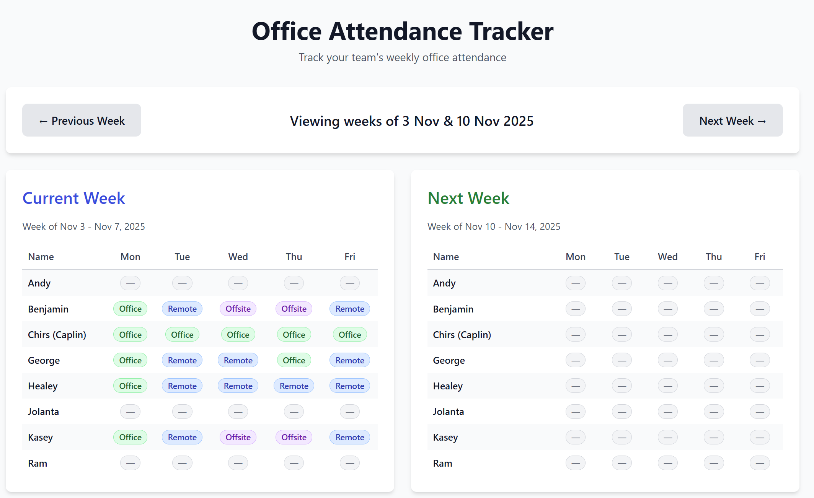

# Office Attendance Tracker - User Guide

Welcome to the Office Attendance Tracker! This guide will help you understand how to use the app to submit your weekly attendance and see where your teammates will be working.

## What is this app for?

The Office Attendance Tracker helps our team coordinate office attendance. You can:
- **Submit your attendance** for the upcoming week
- **View current week** attendance to see who's in the office today
- **View next week** attendance to plan ahead
- **Navigate through weeks** to check past or future attendance

## Getting Started

### Your Login Information

- **Username**: Select your name from the dropdown menu
- **Password**: Your first name in lowercase (e.g., if your name is "John Smith", your password is "john")

## How to Submit Your Attendance

1. **Scroll down** to the "Submit Your Attendance" form at the bottom of the page
   - On mobile: Tap the "Open Form" button to expand the form

2. **Select your name** from the dropdown menu

3. **Choose your location** for each day of the week:
   - 🏢 **Office** - You'll be working from the office
   - 🏠 **Remote** - You'll be working from home
   - ✈️ **Offsite** - You'll be at a client site or other location
   - 🌴 **Holiday** - You're taking time off

4. **Enter your password** (your first name in lowercase)

5. **Click "Submit Attendance"** to save your plans

### Important Notes:
- Submit your attendance for the **upcoming week** (not the current week)
- You can update your attendance anytime by resubmitting the form
- The form will remember your previous submission if you've already filled it out

*The submission form where you enter your attendance for the week*

## Viewing Team Attendance

### Desktop View
On a desktop or laptop, you'll see **two columns side by side**:
- **Left side**: Current Week (in blue) - see who's working where this week
- **Right side**: Next Week (in green) - see planned attendance for next week

### Mobile View
On a phone or tablet, the weeks are **stacked vertically**:
- Current Week appears first
- Next Week appears below

**Compact View**: On mobile, team member cards are collapsed by default showing just a summary (e.g., "3 🏢, 2 🏠")
- **Tap any card** to expand and see the full week breakdown
- **Tap again** to collapse it

*The main attendance view showing current week (blue) and next week (green) side by side*

## Navigating Between Weeks

Use the **navigation buttons** at the top of the page:
- **← Previous Week**: Go back one week
- **Next Week →**: Go forward one week

The header shows which weeks you're currently viewing.

## Understanding the Status Badges

Each team member's daily status is shown with a colored badge:

| Badge Color | Status | Meaning |
|-------------|--------|---------|
| 🟢 Green | Office | Working from the office |
| 🔵 Blue | Remote | Working from home |
| 🟣 Purple | Offsite | At client site or other location |
| 🟡 Yellow | Holiday | Taking time off |
| ⚪ Gray | — | No submission yet |

## Tips

- **Submit early**: Try to submit your attendance by Thursday for the following week
- **Check regularly**: Look at current week attendance to know who's in the office
- **Plan meetings**: Use next week's view to schedule in-person meetings
- **Mobile scrolling**: On mobile, collapse cards you're not interested in to reduce scrolling

## Need Help?

If you:
- **Forgot your password**: Remember, it's just your first name in lowercase
- **Made a mistake**: Just resubmit the form with the correct information
- **See an error**: Try refreshing the page and submitting again

## Questions?

Contact your IT administrator if you need assistance with the app.

---

*Happy tracking! 📊*

